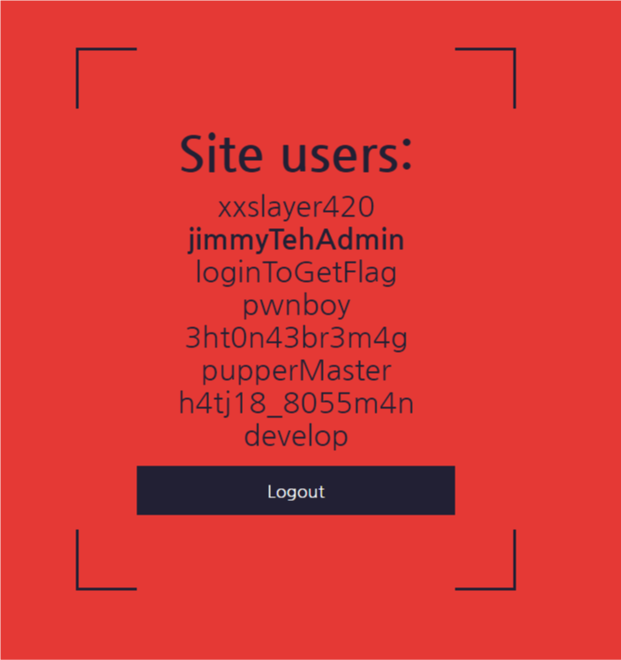

# **Admin Attack**

### 300 Points

#### **Problem**

Looks like we managed to get a list of users. That admin user looks particularly interesting, but we don't have their password. Try and attack the login form and see if you can get anything.

#### **Solution**

We saw in a previous challenge that the admin username is `jimmyTehAdmin` so we want to try and log in as him.



Lets see if this is vunerable to sql injection. I started by just putting a ' in the username field and trying to submit it. That returns the following:

```
Traceback (most recent call last):
  File "/srv/raro/main.py", line 132, in index
    cur.execute("SELECT algo FROM users WHERE username='{}'".format(
sqlite3.OperationalError: unrecognized token: "'''"
```

So it looks like our input is sent straight to the SQL query, so we should be able to use an injectioon attack to get in.

I next tried `' or 1=1;--` but that gets me logged in as a user named xxslayer420

Lets try specifying a username in our query: `' or 1=1 and username = 'jimmyTehAdmin';--`

and with that we get logged in and get our flag: **ractf{!!!4dm1n4buse!!!}**
