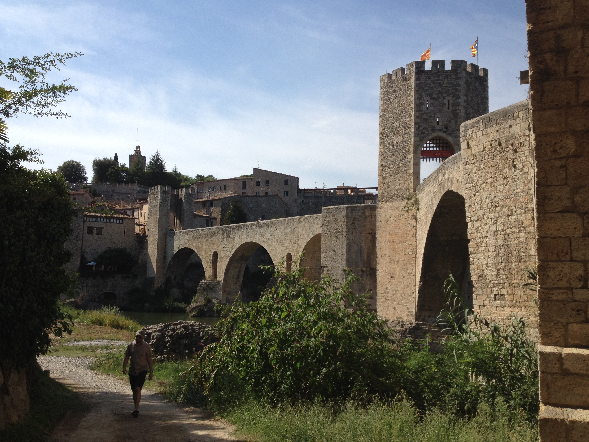

# **Brick By Brick**

### 200 Points

#### **Problem**

Wow! You're killing these! One of our social media monitoring team just sent us an urgent message. I've reproduced it below for you.

> FROM: `__________`@`___________`.org
> TO: `__________`@`___________`.org
>
> > Sorry about the Instagram account fiasco.
> >
> > It looks like the target still hasn't learnt radio
> > silence, and has just created a Twitter account, with
> > the same handle! It doesn't look especially active,
> > but we managed to find a photo of where he was
> > yesterday.
> >
> > Can you work out what town this photo was taken in?
> >
> > One of the other guys on the team thinks if we know
> > where he was we should be able to track him down faster.
> > END
> > As usual, we've set up the map. It should be accurate to 2km.

#### **Solution**

The first thing that caught my attention that might help us figure this out is the flags on the tower. I did a search for "red and yellow stripe flag" and quickly found that the flag is the [Estelada](https://en.wikipedia.org/wiki/Estelada) which is flag flown by independence supporters in the Catalonia region of Spain. This means we are looking for a castle of some sort in Catalonia Spain. I did a search for "famous castles catalonia" and found a travel site that listed several. I scrolled through the list and found that `Castillo de Besalu` looked a lot like the one in our pictures. I zoomed in to that general location on the map and placed the poing and it was correct.