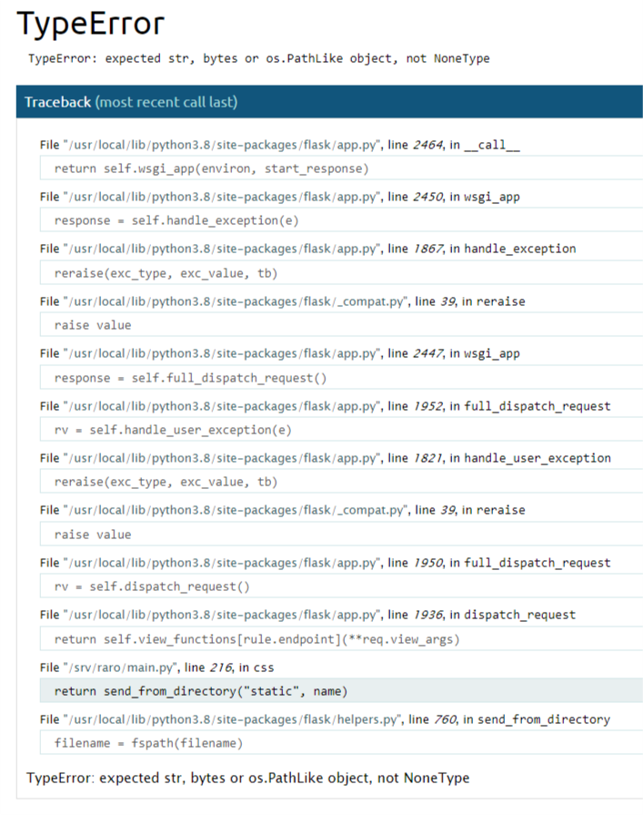

#*Entrypoint*

### 200 Points

####*Problem*
Sadly it looks like there wasn't much to see in the python source. We suspect we may be able to login to the site using backup credentials, but we're not sure where they might be. Encase the password you find in ractf{...} to get the flag.

####*Solution*
I started off by ceking the source on the page just to see if there is anything there, and what do you know we get this comment:
```
<!--
                In case I forget: Backup password is at ./backup.txt
            -->
```
So now we have the location of the backup credentials, we just need to find a way to access them.

Next I looked at robots.txt and there are 4 pages listed there:
+/admin
+/wp-admin
+/admin.php
+/static

The first 3 return a page not found error, but the 4th one returns something intersting:



It looks like this page is expecting to be passed a file of some kind. Lets add `/backup.txt` to that URL and see what happens.

```
develop    developerBackupCode4321

Make sure to log out after using!

TODO: Setup a new password manager for this
```

There are the backup credentials. So we wrap the password in our flag string and we get the flag: *ractf{developerBackupCode4321}

