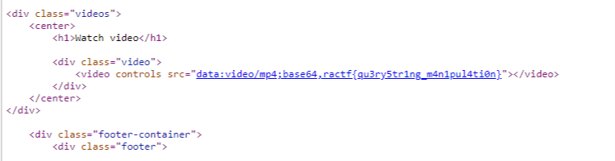

# Finding **Server** Information

#### 350 Points

### **Problem**

See if you can find the source, we think it's called app.py

### **Solution**

After getting logged in in [Quarantine](quarantine.md) we see there are 3 videos listed to watch. They all use the url /watch/\<filename\>, so it appears that it is just loading the file from a directory (I had previously solved [Entrypoint](entrypoint.md) and assumed this was similar to the /static directory found there). So what if we just try /watch/app.py. We are get a page with a video player that doesn't seem to have anything in it:

Since we didn't get an error trying to load the page, lets check the source code and see what we got:

And what do you know. There is our flag: **ractf{qu3ry5tr1ng_m4n1pul4ti0n}**

