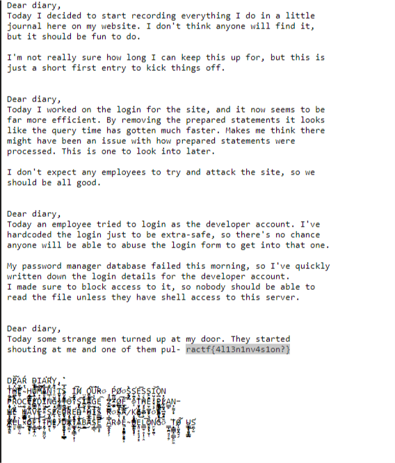

# **Xtremely Memorable Listing**

### 200 Points

#### **Problem**

We've been asked to test a web application, and we suspect there's a file they used to provide to search engines, but we can't remember what it used to be called. Can you have a look and see what you can find?

#### **Solution**

There is a file called sitemap.xml that sites can host at their root that will tell search engines what the layout of their site is that makes it easier for it to be crawled for search indexing. That is likely what is being referenced here. So we go to ip/sitemap.xml and we see this:

```xml
urlset xmlns="http://www.sitemaps.org/schemas/sitemap/0.9">
<url>
<loc>https://fake.site/</loc>
<lastmod>2019-12-12</lastmod>
<changefreq>always</changefreq>
</url>
<!-- Backup version at sitemap.xml.bak -->
</urlset>
```

Nothing here, but it looks like there is a reference to a backup one, so lets take a look at that.

Opening up sitemap.xml.bak we see:

```xml
<?xml version="1.0" encoding="UTF-8"?>
<urlset xmlns="http://www.sitemaps.org/schemas/sitemap/0.9">
   <url>
      <loc>https://fake.site/</loc>
      <lastmod>2019-12-12</lastmod>
      <changefreq>always</changefreq>
   </url>
   <url>
      <loc>https://fake.site/_journal.txt</loc>
      <lastmod>2019-12-12</lastmod>
      <changefreq>always</changefreq>
   </url>
</urlset> 

```

Looks like there is a page called _journal . Lets go check that out. We navigate there and we see:



And there at the bottom we get our flag: **ractf{4l13n1nv4s1on?}**