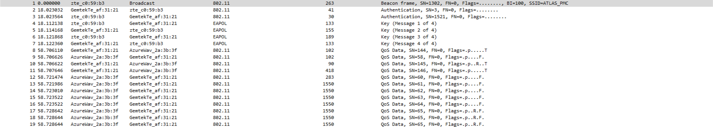

# **Peculiar Packet Capture**

### 400 Points

#### **Problem**

Agent,

We have a situation brewing. Last week there was an attack on the prime minister of Morocco. His motorcade was stopped by a road blockade where heavily armed men opened fire on them. Fortunately, the prime minister was able to escape safely but many personnel and a few other ministers did not.

ATLAS, a multi-national Private Military Corporation (PMC) based in Colorado, USA, is our main suspect. We believe they were hired to conduct the hit by the opposition political party.

We flew Agent Jason to Colorado to investigate further. He gained access to their building's reception area dressed in a suit acting as a potential client with an appointment. He was able to intercept wireless network traffic from their corporate wireless network before being escorted out by guards when they realized the bluff.

The network capture is attached below, see if you can recover any important documents which could help us tie ATLAS to the Morocco incident.

[ATLAS_capture.cap](files/ATLAS_capture.cap)

#### **Solution**

If we open up our pcap we see the following:

Looks like a lot of traffic that we can't see anything in. But it does look like we have a WiFi hanshake going on. Maybe we can get something from that. I ran aircrack-ng against the pcap using the rockyou.txt wordlist. It ran for a few seconds and we got this:

So the password for the network is `nighthawk`

Next we can take that back to wireshark and enter it as a password. In preferences > protocols > IEEE802.11 > decryption keys

We add nighthawk as a wpa-password and save change and all of a sudden we see this in the pcap:

Look at that, decrypted traffic. That file called HK_AG_KA_2018_Financial_Statement.pdf seems interesting. Let's extract that and see what we get. We open the file and scroll to the bottom and we see this

And there is our flag: **ractf{j4ck_ry4n}**