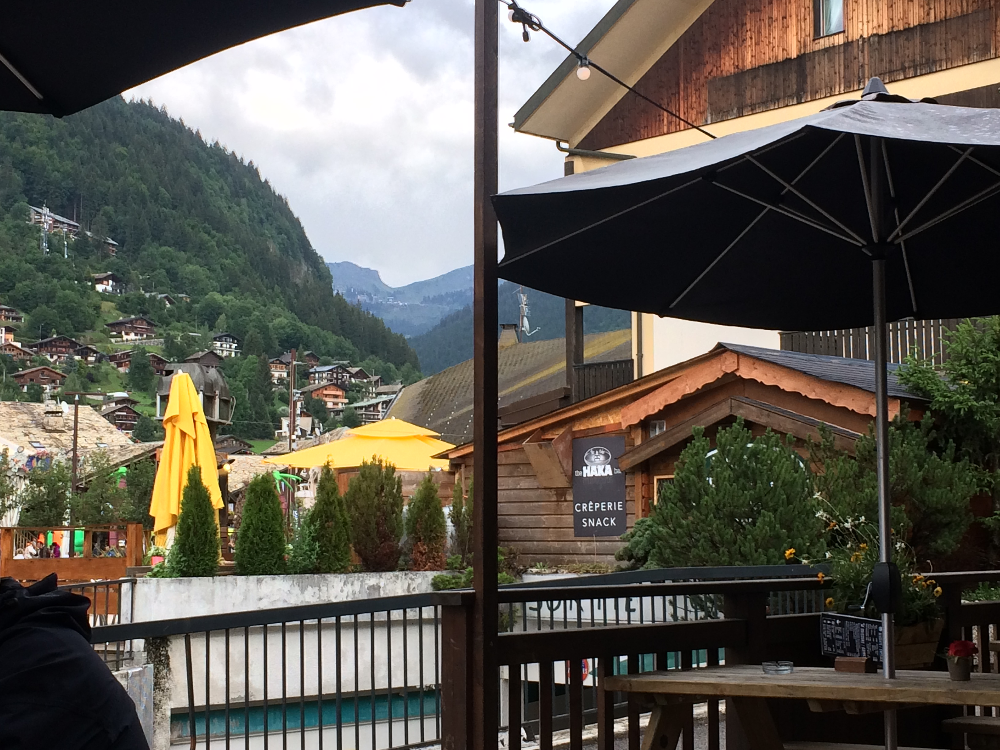

#*Remote Retreat*

###250 Points

####*Problem*
Agent, it's good to have you.

One of our targets has been constantly avoiding us, but we managed to find their private Instagram. They just posted a photo, but we can't work out where they are. We tried to check the EXIF data, but it appears the social platform removes it automatically.

Let us know where he is by clicking on the map, you'll have to be accurate to within 500 meters!

####*Solution*
Looks like we have a sign for a restaurant that we can look for. Doing a quick google search for "the Haka bar" we see that there is a place with that name that has the address `57 Route de la Combe À Zore, 74110 Morzine, France` we go there on the map and we can see that it is close to some mountains, so this looks like the right place. I put the pin on the map and it was correct.