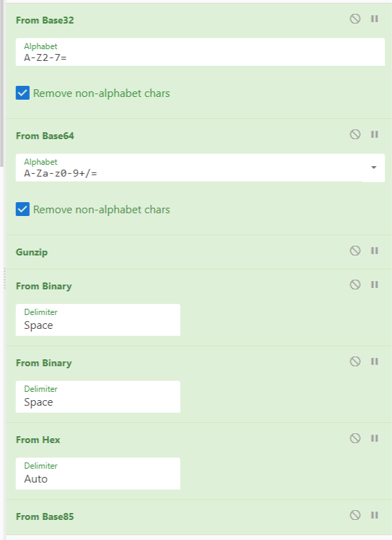

#*Spentalkux*

### 300 Points

####*Problem*
Spentalkux 🐍📦

####*Solution*
Not a whole lot to go off of on this initially, but that looks like a python and a package. A quick internet search shows me that there is indeed a projuct called Spentalkux on pypi.org

Going to that page we download the latest version and look in the code. There we see a base64 string that is decoded and executed. When decoded it gives us the following

```python
import time

go_away_msgs = ["Goodbye now.", "That's your cue to leave, bro", "Exit stage left, pal", "OFF YOU POP.", "You know what I haven't got time for this", "Forking and executing rm -rf."]

time.sleep(1)
print("Hello.")
time.sleep(2)
print("Can I help you?")
time.sleep(2)
print("Oh, you're looking for something to do with *that*.")
time.sleep(2)
print("My creator left this behind but, I wonder what the key is? I don't know, but if I did I would say it's about 10 characters.")
time.sleep(4)
print("Enjoy this.")
time.sleep(1)
print("Ztpyh, Iq iir'jt vrtdtxa qzxw lhu'go gxfpkrw tz pckv bc ybtevy... *ffiieyano*. New cikm sekab gu xux cskfiwckr bs zfyo si lgmpd://zupltfvg.czw/lxo/QGvM0sa6")
time.sleep(5)
for i in go_away_msgs:
    time.sleep(3)
    print(i)
time.sleep(0.5)
```

So immediatley the  strange string stands out to us. It appears to be some sort of Cipher Text

I found that it was a Vigenere Autokey Cipher. But we needed a key to solve that. The script said it was about 10 letters and spentalkux happens to be 10 letters.

I deoded that with an [online tool](https://www.boxentriq.com/code-breaking/vigenere-cipher) that I found using that key

Hello, If you're reading this you've managed to find my little... \*interface\* The next stage of the challenge is over at https://pastebin.com/raw/BCiT0sp6

When we went there it was a long list of hex charachters. When you decode them you see it is the contents of a png file. Once you save that you get this:


In the image we have the following text on a red background:

```
look back into the past...

Find what you have forgotten...

01011111 01101000 01100101 01110010 01110010 01101001 01101110 01100111
```

When that binary is decoded is says `_herring` , meaning this path was a red herring.

There was an older version of that package on PyPi so lets go look at that. After downloading that file we see a simmilar base64 string and when decoded gives us the following code

```python
import time

go_away_msgs = ["This is the part where you *leave*, bro.", "Look, if you don't get outta here soon ima run rm -rf on ya", "I don't want you here. GO AWAY.", "Leave me alone now.", "GOODBYE!", "I used to want you dead but...", "now I only want you gone."]

time.sleep(1)
print("Urgh. Not you again.")
time.sleep(2)
print("Fine. I'll tell you more.")
time.sleep(2)
print("...")
time.sleep(2)
print("But, being the chaotic evil I am, I'm not giving it to you in plaintext.")
time.sleep(4)
print("Enjoy this.")
time.sleep(1)
print("JA2HGSKBJI4DSZ2WGRAS6KZRLJKVEYKFJFAWSOCTNNTFCKZRF5HTGZRXJV2EKQTGJVTXUOLSIMXWI2KYNVEUCNLIKN5HK3RTJBHGIQTCM5RHIVSQGJ3C6MRLJRXXOTJYGM3XORSIJN4FUYTNIU4XAULGONGE6YLJJRAUYODLOZEWWNCNIJWWCMJXOVTEQULCJFFEGWDPK5HFUWSLI5IFOQRVKFWGU5SYJF2VQT3NNUYFGZ2MNF4EU5ZYJBJEGOCUMJWXUN3YGVSUS43QPFYGCWSIKNLWE2RYMNAWQZDKNRUTEV2VNNJDC43WGJSFU3LXLBUFU3CENZEWGQ3MGBDXS4SGLA3GMS3LIJCUEVCCONYSWOLVLEZEKY3VM4ZFEZRQPB2GCSTMJZSFSSTVPBVFAOLLMNSDCTCPK4XWMUKYORRDC43EGNTFGVCHLBDFI6BTKVVGMR2GPA3HKSSHNJSUSQKBIE")
time.sleep(5)
for i in go_away_msgs:
    time.sleep(2)
    print(i)
time.sleep(0.5)
```

From this one we can see a new string for us to play with. This one took a lot of trial and error in CyberChef to get it fully decoded.

In the end, here is the recipe that fully decoded it:



So written out that was Base32 > Base64 > Gunzip > Binary > Binary > Hex > Base85.

With all that we finally get our flag: *ractf{My5t3r10u5_1nt3rf4c3?}*

